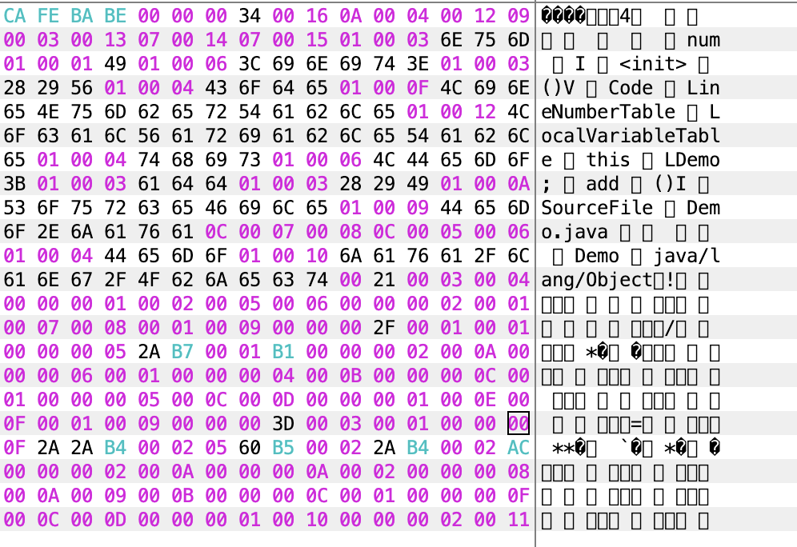
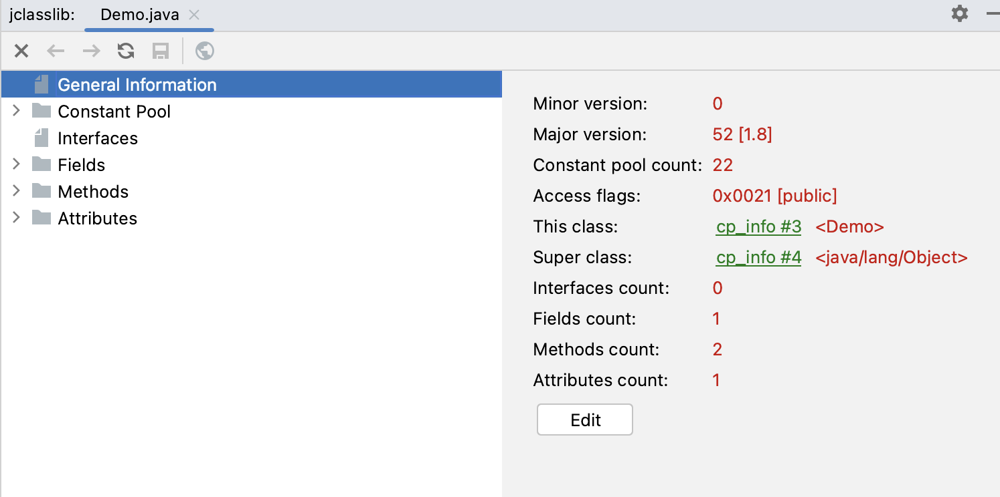
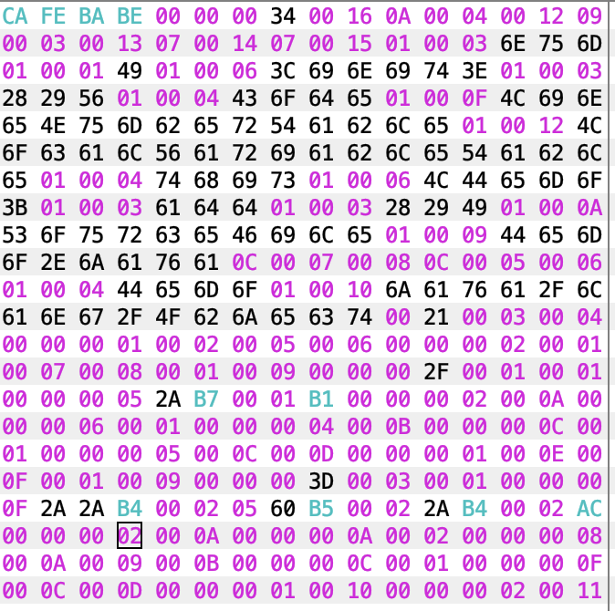
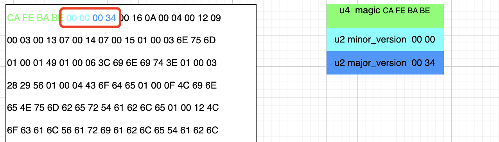
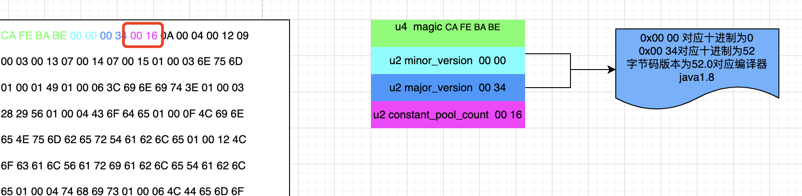
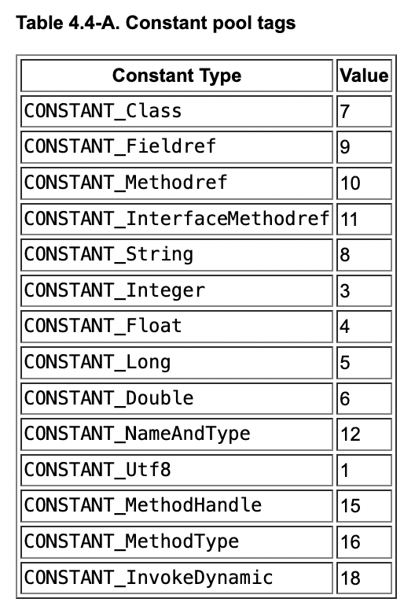

# 简介

[java虚拟机规范][docs.oracle.com/javase/specs/index.html]

本文主要是针对java字节码进行学习的阐述。其中主体为jdk8的内容，而java8中的字节码规范文档位置位于第四章节。

[][]

[java8字节码规范文档][https://docs.oracle.com/javase/specs/jvms/se8/html/jvms-4.html]

我们的工具都是使用的idea的插件，Binary/hex editor和jclasslib。分别查看二进制内容和字节码内容。

# 一、字节码简述

实际上java源码通过javac的前端编译器的编译之后，就会生成字节码。而这个字节码不仅仅是java的专属，实际上你只要按照这个字节码规范实现了你的字节码生成结果，就可以运行在jvm上，所以jvm虚拟机上可以跑很多语言，比如java，scala等等。

而字节码的格式也很简单，**就是一个字节长的操作码**+多个操作参数，其中操作参数有时候可以没有。这个我们后面会见到很多这类。

而字节码文件没有任何分隔符，不像什么xml有标记符号，他就是根据空格来划分的。所以就要严格按照字节码规范顺序来生成，他按照这个顺序来解析。这种没有分隔符可以极限的节省空间。

其次我们的代码编译之后的class文件其实就是字节码文件，jvm解析的字节码文件可以是我们编译之后的磁盘上的class文件，也可以是网络上的文件流。只要你是字节码格式的就没问题，他的解析来源是没硬性要求的。

# 二、class文件规范

## 1、字节码格式

我们在java字节码规范文档第四章可以看到，一个class文件的字节码内容有如下内容：

其中可以看到一些u2 u4 之类的描述，他们表示的是占用多少个字节长度。比如第一项u4             magic;表示的就是我们编译出来的字节码文件第一部分是一个占四字节长度的内容，也就是magic，就是魔数。其他的也是一样的含义。

而还有一些不是这种的，比如cp_info，field_info ，method_info，attribute_info在字节码规范中表示一个数组，这个数组里面有很多元素，每个元素其实也还是一个一个的u2 u4 u8这种。他是个组合结构体，也有人叫表。

之所以存在表这个结构是因为有些部分是不确定的，比如cp_info，这个结构表示常量池的内容，而一个类里面的常量是不固定的，所以他不能固定用某一个u2 u8这种表示，他是个数组。但是数组里面有多个，那怎么知道到哪个结束呢，毕竟也没有个开始符号之类的。所以每一个这种表的前一项就是他的长度，比如cp_info的前面是一个u2两字节长度的constant_pool_count，表示的是这个cp_info里面有多少项内容。类似tcp那种头体分离的机制。

~~~markdown
ClassFile {
    u4             magic;
    u2             minor_version;
    u2             major_version;
    u2             constant_pool_count;
    cp_info        constant_pool[constant_pool_count-1];
    u2             access_flags;
    u2             this_class;
    u2             super_class;
    u2             interfaces_count;
    u2             interfaces[interfaces_count];
    u2             fields_count;
    field_info     fields[fields_count];
    u2             methods_count;
    method_info    methods[methods_count];
    u2             attributes_count;
    attribute_info attributes[attributes_count];
}
~~~

具体解释如下表展示：

| 类型           | 名称                | 说明                                                         | 长度  | 数量                  |
| -------------- | ------------------- | ------------------------------------------------------------ | ----- | --------------------- |
| u4             | magic               | 魔数，用来标识这个文件是一个字节码文件，如果不是这个内容就不是 | 4字节 | 1                     |
| u2             | minor_version       | 小版本号                                                     | 2字节 | 1                     |
| u2             | major_version       | 大版本号                                                     | 2字节 | 1                     |
| u2             | constant_pool_count | 常量池计数器，表示常量池里面有多少常量                       | 2字节 | 1                     |
| cp_info        | constant_pool       | 常量池表                                                     | n字节 | constant_pool_count-1 |
| u2             | access_flags        | 访问标识，比如你是一个类还是接口，有没有final或者抽象类修饰，public还是啥。都在这里存储。 | 2字节 | 1                     |
| u2             | this_class          | 就表示当前这个类的名字                                       | 2字节 | 1                     |
| u2             | super_class         | 当前类的父类名字                                             | 2字节 | 1                     |
| u2             | interfaces_count    | 当前类实现的接口个数                                         | 2字节 | 1                     |
| u2             | interfaces          | 当前类实现了哪些接口，通过符号存储的，所以2字节能存很多很多，就是接口的索引集合 | 2字节 | interfaces_count      |
| u2             | fields_count        | 当前类的字段个数                                             | 2字节 | 1                     |
| field_info     | fields              | 当前类的字段内容表                                           | n字节 | fields_count          |
| u2             | methods_count       | 当前类方法的个数，最少也有个构造的init                       | 2字节 | 1                     |
| method_info    | methods             | 当前类方法信息表                                             | n字节 | methods_count         |
| u2             | attributes_count    | 当前类的一些属性，属性个数                                   | 2字节 | 1                     |
| attribute_info | attributes          | 当前类的属性信息表                                           | n字节 | attributes_count      |

## 2、准备材料

下面我们就开始阅读一下编译出来的字节码看是不是和这个规范一致。

我们先用最简单的一段代码开始。

> 源码

~~~java
/**
 * 字节码学习
 */
public class Demo {
    private int num;

    public int add() {
        num = num + 2;
        return num;
    }
}
~~~

> 编译出来的二进制字节码

我们用Binary/hex editor插件打开class文件如下：显示为十六进制的表达，其中每一个位置表示1个字节。比如CA FE BA BE其实就是4字节。因为一个字母数是一个十六进制数，其实就是4位，两个就是8位1字节。

十六进制的A代表十进制的10，然后往下推。

> 二进制字节码编译可视化结果

我们用jclasslib插件看一下这个二进制对应的class结构，然后和我们这个二进制的做对比。看看是不是能对上。查看方法很简单，鼠标选中那个类，然后idea中在view选中jclasslib打开就好。结构如下。

具体里面有很多表项，我们后面挨个打开看看。

# 三、解析字节码

下面我们就来解析一下我们上面那个类生成的字节码，我这里先把总的字节码内容放出来。如下。

接下来我们就一点一点按照那个字节码规范中的格式来看看他是不是真的能对上。

## 1、magic：魔数

第一部分是一个u4类型，也就是占四个字节的magic魔数，他是固定的内容，为**0xCAFEBABE**,这个内容，他的作用是标识这个文件是一个字节码文件，当编译器解析这个字节码文件的时候会先读取开头四字节，如果发现是这个内容，那就没错，就接着往下读取，如果发现不是这个魔数，那就直接报错。这样的作用是一个标志。不能只看你是个.calss文件，万一你随便写点啥整个class文件那肯定不行。文件扩展名是可以随便改的，这个魔数类似一个防伪标识。

我们看到第一部分确实就是这个内容。

## 2、主副版本

紧接着魔数的四个字节就是字节码文件的版本号，版本号分为两部分，分别是两个u2类型，各自占两个字节一共是四个字节。

也就是说第5，6个字节所代表的含义就是编译之后的副版本(minor_version)，而7，8个字节代表的就是主版本(major_version)。

这两个版本号一起构成了class字节码文件的格式版本号，比如主版本号为M,副版本号为m,那么这个class文件的版本号就为M.m。

版本号和我们编译器的版本号对应关系如下。

| 主版本(十进制) | 副版本(十进制) | 编译器版本(java版本) |
| -------------- | -------------- | -------------------- |
| 45             | 3              | 1.1                  |
| 46             | 0              | 1.2                  |
| 47             | 0              | 1.3                  |
| 48             | 0              | 1.4                  |
| 49             | 0              | 1.5                  |
| 50             | 0              | 1.6                  |
| 51             | 0              | 1.7                  |
| 52             | 0              | 1.8                  |
| 53             | 0              | 1.9                  |
| 54             | 0              | 1.10                 |
| 55             | 0              | 1.11                 |

我们按到每次发行大版本的时候都会在主版本上面+1，而副版本从jdk1之后就一直都是0了，我们目前使用的是jdk1.8所以我们的主副版本分别是52和0.

而且java是向前兼容的，也就是如果你在低版本的jdk上编译出来的代码(实际jvm运行的是class文件)，你低版本的字节码文件是可以在高版本上运行的。但是高版本编译出来的结果无法在低版本运行。

我们说我们目前使用的是jdk1.8所以我们的主副版本分别是52和0。那我们来看一下是不是:

我们看到第5，6个字节是副版本，也就是十六进制的00 00 换为十进制就是0。而第7，8个字节是主版本，是十六进制的00 34，换算为十进制就是52。对应我们那个表格来看其版本就是jdk1.8，没毛病。

## 3、常量池

在主副版本之后，字节码文件就来到了常量池的部分，这部分是字节码文件中最重要的部分之一。也是内容最庞大的之一。

在常量池表中存储了编译时期生成的各种字面量和符号引用。这部分内容将会在类加载后进入方法区的运行时常量池存放，而每个版本的hotspot实现的常量池位置不同，这个我们不深究了。

常量池在字节码中的表述由两部分组成，分别是常量池计数器和常量池表。

这么设计的原因是因为常量池中的常量的数量不能确定，每个类都可能有多个，所以他用了一种类似数组的表述，但是因为字节码文件他没有分隔符，我就知道是从主副版本之后开始的常量池，但是不知道啥时候结束的。所以他使用了一种类似网络协议中的头体分离的设计。先用两个字节来存常量池内容的个数，然后下面再存这么多的常量池内容，这样他解析的时候就知道解析多少内容了。

而这部分内容我们说分为两部分，一个是存储常量池表长度的constant_pool_count，类型为u2占用2字节。

另一个是存储常量池表的constant_pool，类型为cp_info。这个里面你可以理解为一个数组，每一项就是一个常量池表项。而这个表的设计和我们在java层面编码时候的数组略有不同，因为他的下标是从1开始的。我们java编码一般是从0开始。

而且还有一个点就是，因为他是从1开始的，实际上他不是没有0，而是把0空出来了。

比如我们的constant_pool_count为10，那他的数组下标实际是从1-9，表示的长度就是9，他的0空出来了，用来做一些后续的扩展。

而下标为0的部分他用来做一些特殊场景，比如说后面我们的字节码的方法部分经常会引用一些常量，在字节码的表现就是后面会跟一个常量的符号，那有的地方人家就是不想引用，那就跟一个下标为0的那个符号，这不就有用了吗。

所以他常量池表实际存的真实内容的就是从1开始到constant_pool_count-1，其中0位置没存东西。

### 3.1、常量池计数器constant_pool_count

那么我们来看看版本号后面的2字节的constant_pool_count，

如上图所示我们的constant_pool_count为0x 0016，对应的十进制数就是22。所以对应的我们的常量池表里面是从1-21

### 3.2、常量池表constant_pool[]

constant_pool是一种表结构，他是从1-constant_pool_count - 1为索引范围，表明了后面有多少个常量项。

常量池内主要存放两大类常量：字面量(Literal)和符号引用(Symbolic References)

它包含了class文件结构以及其子结构中引用的所有字符串常量，类或者接口名，字段名和其他常量。常量池中每一项都具备相同的特性，第一个字节作为类型标记，用于确定该项的格式，这个字节称之为tag byte(标记字节，标签字节)

这个类型其实不多，这么多年一直比较固定，类型如下表：

官方的描述是这样的一个表：

| 类型                        | 标识(标志) | 描述                   |
| --------------------------- | ---------- | ---------------------- |
| CONSTANT_Class              | 7          | 类或者接口的符号引用   |
| CONSTANT_Fieldref           | 9          | 字段的符号引用         |
| CONSTANT_Methodref          | 10         | 类中方法的符号引用     |
| CONSTANT_InterfaceMethodref | 11         | 接口中方法的符号引用   |
| CONSTANT_String             | 8          | 字符串类型字面量       |
| CONSTANT_Integer            | 3          | 整形字面量             |
| CONSTANT_Float              | 4          | 浮点型字面量           |
| CONSTANT_Long               | 5          | 长整型字面量           |
| CONSTANT_Double             | 6          | 双精度浮点型字面量     |
| CONSTANT_NameAndType        | 12         | 字段或者方法的符号引用 |
| CONSTANT_Utf8               | 1          | Utf-8编码的字符串      |
| CONSTANT_MethodHandle       | 15         | 方法句柄               |
| CONSTANT_MethodType         | 16         | 方法类型               |
| CONSTANT_InvokeDynamic      | 18         | 动态方法调用点         |

其实这个表N多年没变过了，因为他就那么多类型。其中15 16 18号标志的类型是从jdk7加进来的，java从jdk7之后开始大面积支持动态语言调用，具体可以去看jsr292。

所以我们看到主要是存储的字面量和符号引用。

#### 3.2.1、字面量和符号引用

我们来解释一下什么叫字面量和符号引用。

**字面量:**

- 文本字符串，比如你String str = "levi";这就是文本字符串。
- 声明为final的常量值。final修饰的属于是常量值，在编译期就确定了。

**符号引用:**类和接口的全限定名，字段的名称和描述符，方法的名称和描述符。

我们这里提到了不少概念，比如什么全限定名，什么描述符等等，我们分别来解释一下这些概念。

- 全限定名：比如你有一个类，com/levi/Demo这个类的全部包名都列出来用/分隔，就是这个Demo类的全限定名。为了使多个连续的全限定名之间不会产生混淆，每一个类的全限定名后面会加一恶搞;用来表示当前全限定名结束。

- 简单名称：简单名称值得是没有类型和参数修饰的方法或者字段名称，比如你的一个类中的add()方法和private int num这个字段的简单名称分别是add和num，就是去掉那些修饰符之后的东西。

- 描述符：描述符的作用是用来描述字段的数据类型，方法的参数列表(包括数量，类型以及顺序)和返回值，根据描述符规则，基本数据类型(byte,char,dubble,float,int.long.short,boolean)以及代表无返回值的void类型都用一个大写字符来表示，而对象类型则用字符L加全限定名来表示，详细规则见下表：

  | 标志符 | 含义                                                         |
  | ------ | ------------------------------------------------------------ |
  | B      | 基本数据类型byte                                             |
  | C      | 基本数据类型char                                             |
  | D      | 基本数据类型double                                           |
  | F      | 基本数据类型float                                            |
  | I      | 基本数据类型int                                              |
  | J      | 基本数据类型long                                             |
  | S      | 基本数据类型short                                            |
  | Z      | 基本数据类型boolean                                          |
  | V      | 代表void类型                                                 |
  | L      | 对象类型，比如Ljava/lang/Object;包括字符串类型也是对象。对象类型是要标志符+对象类的全限定名表达。 |
  | [      | 数组类型，一个[代表一维数组，两个[[就代表二维数组，三个就是三维等等，比如double类型的二维数组double【】【】 就是 [[[D |

  当在字节码中使用描述符来描述方法的时候，需要按照先参数列表，后返回值的顺序描述，参数列表按照参数的严格顺序放在一组小括号()之内,返回值类型用标志符+类全限定名的方式表达，下面我们用两个例子来说明这套规则。

  > 案例一：方法java.lang.String.toString()

  首先他的参数列表为空，返回值为字符串类型(属于对象类型)，

  按照先参数列表,参数列表按照严格顺序放在小括号内，然后返回值的顺序来看，就是()Ljava/lang/String;

  > 案例二：int abc(int[] x,int y)

  方法int abc(int[] x,int y)的描述符为([II)I

- 补充说明：

  ~~~markdown
  补充说明:
  虚拟机在加载class文件时才会进行动态链接，也就是说，class字节码文件中不会保存各个方法和字段的最终内存布局信息，因此，这些字段和方法的符号引用不经过转换是无法直接被虚拟机使用的，当虚拟机运行的时候，需要从常量池中获取对应的符号引用，在类加载过程中的解析阶段将符号引用替换为直接引用，并且翻译到具体的内存地址中。
  
  这里说明下符号引用和直接引用的区别与关联:
  	符号引用:符号引用以一组符号来描述所引用的目标，符号可以是任何形式的字面量，只要使用时能无歧义地定位到目标即可。符号引用与虚拟机实现的内存布局无关，引用的目标并不一定已经加载到了内存中。
  	
  	直接引用:直接引用可以是直接指向目标的指针、相对偏移量或是一个能间接定位到目标的句柄。直接引用是与虚拟机实现的内存布局相关的，同一个符号引用在不同虚拟机实例上翻译出来的直接引用一般不会相同，如果有了直接引用，那说明引用的目标必定已经存在于内存中了。
  ~~~

  这个说明看着其实还是云山雾罩的，因为我们还没有看到字节码下面的那些符号引用到底是啥。我这里可以先简单解释一下，这段话的意思其实是说，当我们的源码文件被javac编译之后成为class字节码文件，此时我们称之为他的布局是静态的，并没有加载到内存中，比如你的方法引用了一个字段，此时仅仅是这个方法在字节码中用字符串写了一个这个字段的符号，此时他还没加载到内存中，没真正引用到对象呢，不过这也是句废话，你都没动态加载到内存自然也不会引用对象，就是标记了一下。

  等到字节码倍加载器加载到内存中，此时程序开始执行，此时会在解析阶段把字节码文件里面那些记号符号都连接到真实的位置，地址等等，就是在内存里面真实引用到这些东西了，因为已经进入内存了，运行起来了。

  后面我们看到符号就会更加深入的理解到。

